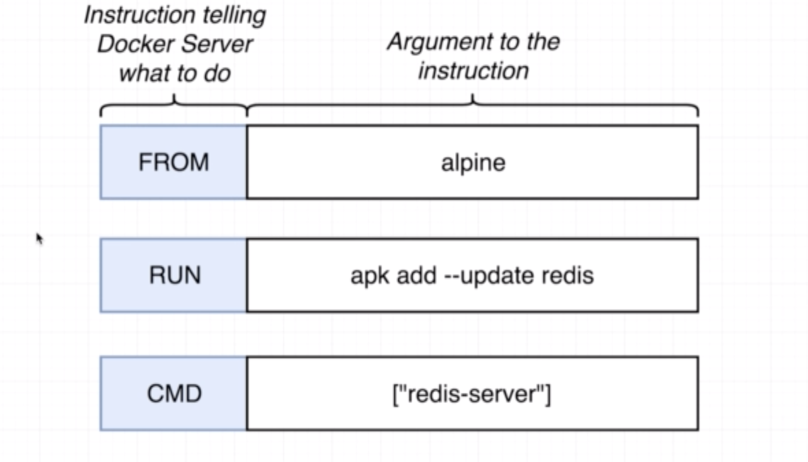

# Docker-Training

Basics of Docker and How to create Docker files, docker commands usage

ex-01: Launch DockerQuickStart Terminal and check installation is successful.

- To check docker version use command <b>docker -v</b>
  o/p: My docker version is : Docker version 17.09.0-ce, build afdb6d4
- To run a simple image use command
  <b> docker run hello-world </b>
  This will first search in local registry and if the image is not found it goes to docker registry (like appstore)
  where it pulls hello-world image and run's this as container.
- To see the last container that was run as image we use the command <b>docker ps -l</b> (last exited container)

Let's check the running containers

```bash
$ docker ps
```

Nothing here, this is because hello-world container is only printing a message, then once the process is exited, the container is stopped. This is the behaviour for all containers : they stop on process exit (can be a normal exit for a task, or an error exit for a long living service such as a web server).

Here is the way to list all containers, even the ones not running

```bash
$ docker ps -a
```

Here you should see all existing containers, running or not.

To Stop a running container:
(To get the cotainerid use docker ps -a )

```bash
docker stop containerid.
```

ex: docker stop 123450ap

To Kill a container:

```bash
docker kill 123450ap
```

To Remove a image from local registry:

```bash
docker rmi Imageid
```

Images: This folder contains the images that are created by using dockerfile.

Create a Docker Image:

- Specify a Base Image (Use an existing docker image as base)
- Run Some Commands to install additional programs (Download and install a depedency)
- Specify a command to run the container startup (Tell the image what to do when it starts as container)

Ex:1 To run the redis-server image
CMD -> images->redis-server and enter the following CMD below shown
docker build . (This builds the docker image) copy the id from the o/p printed in terminal.
open another terminal and run
docker run id



Convention for Tagging Image:

YourDockerID/imagename:latest
rakeshcheekatimala/redis:latest
